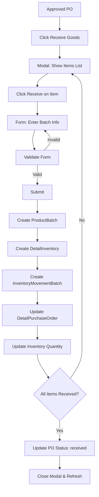

# Purchase Order List Components

## 📁 Cấu trúc thư mục

```
PurchaseOrderList/
├── PurchaseOrderList.jsx              # Main list component
├── PurchaseOrderListHeader.jsx        # Header with filters & actions
├── AddPurchaseOrderModal.jsx          # Modal tạo PO mới
├── EditPurchaseOrderModal.jsx         # Modal sửa PO
├── ReceivePurchaseOrderModal.jsx      # Modal nhận hàng ⭐
├── ReceiveBatchInfoForm.jsx           # Form nhập batch info ⭐
├── InvoicePurchaseModal.jsx           # Modal xem invoice
└── README.md                          # This file
```

---

## 📋 Component Overview

### 1. PurchaseOrderList.jsx
**Main component** hiển thị danh sách Purchase Orders với đầy đủ chức năng.

#### Props:
```jsx
{
  purchaseOrders: Array,     // Danh sách POs
  onSort: Function,          // Handle sort
  sortField: String,         // Current sort field
  sortOrder: String,         // 'asc' | 'desc'
  onRefresh: Function        // Callback sau khi thay đổi
}
```

#### Features:
- ✅ Sortable columns (ID, Supplier, Total, Date, Delivery)
- ✅ Status badges với màu sắc theo trạng thái
- ✅ Status dropdown (Pending/Approved → change status)
- ✅ Actions dropdown:
  - View Invoice
  - **Receive Goods** (chỉ cho approved POs) ⭐
  - Edit (không cho cancelled)
  - Delete (chỉ cho received/cancelled)
- ✅ Responsive table layout

#### Status Colors:
```javascript
pending:   #f59e0b  // Orange
approved:  #3b82f6  // Blue
received:  #10b981  // Green
cancelled: #ef4444  // Red
```

#### Workflow:
```
pending → approved → received
pending → cancelled
approved → cancelled (no inventory impact)
```

---

### 2. ReceivePurchaseOrderModal.jsx ⭐
**Modal chính** để nhận hàng từ Purchase Order đã approve.

#### Props:
```jsx
{
  isOpen: Boolean,
  onClose: Function,
  onSuccess: Function,
  purchaseOrder: Object      // PO object với status = 'approved'
}
```

#### Features:
- ✅ Hiển thị tất cả items trong PO
- ✅ Progress bar theo dõi % items received
- ✅ Receive từng item một
- ✅ Validation: chỉ mở khi PO status = `approved`
- ✅ Auto-update PO status → `received` khi hoàn tất

#### Workflow:
```
1. Load PO details (items list)
2. User clicks "Receive" on each item
3. Show ReceiveBatchInfoForm
4. User fills batch info (mfg, exp, location)
5. Submit → Creates:
   - ProductBatch
   - DetailInventory
   - InventoryMovementBatch
   - Update DetailPurchaseOrder
6. Mark item as received
7. When all items received → Update PO status
8. Close modal & refresh
```

#### State Management:
```javascript
const [poDetails, setPODetails] = useState([]);
const [receivingItem, setReceivingItem] = useState(null);
const [receivedItems, setReceivedItems] = useState(new Set());
const [loading, setLoading] = useState(false);
const [apiError, setApiError] = useState('');
```

#### Key Logic:
```javascript
// Check if all items received
const allReceived = poDetails.every(detail =>
  receivedItems.has(detail._id) || detail._id === currentDetail._id
);

if (allReceived) {
  await purchaseOrderService.receivePurchaseOrder(poId);
  onSuccess();
  onClose();
}
```

---

### 3. ReceiveBatchInfoForm.jsx ⭐
**Form component** để nhập batch information khi receive goods.

#### Props:
```jsx
{
  poDetail: Object,          // Detail PO item
  onSubmit: Function,        // Handle submit
  onCancel: Function,        // Handle cancel
  loading: Boolean
}
```

#### Form Fields:
```javascript
{
  quantityReceived: Number,      // Required, <= ordered qty
  mfgDate: Date,                 // Required, <= today
  expiryDate: Date,              // Required, > mfgDate, > today
  warehouseLocation: String,     // Required, max 50 chars
  notes: String                  // Optional, max 500 chars
}
```

#### Validation Rules:
| Field | Rule | Error Message |
|-------|------|---------------|
| Quantity | > 0 | Must be greater than 0 |
| Quantity | <= ordered | Cannot exceed ordered quantity |
| Mfg Date | <= today | Cannot be in the future |
| Exp Date | > mfg date | Must be after manufacturing date |
| Exp Date | > today | Must be in the future |
| Location | not empty | Location is required |

#### Features:
- ✅ Real-time validation
- ✅ Error messages per field
- ✅ Shelf life calculation (days between mfg & exp)
- ✅ Percentage indicator (received/ordered)
- ✅ Partial receive warning
- ✅ Character counter for notes
- ✅ Product info header (image, name, ordered qty, price)

#### UI Elements:
```jsx
// Product Info Header
<div className="bg-emerald-50 border border-emerald-200">
  
  <h4>{product.name}</h4>
  <div>
    Ordered: {quantity} | Price: {unitPrice} | Total: {total}
  </div>
</div>

// Quantity with percentage
<input type="number" />
<span>{(received/ordered * 100).toFixed(0)}%</span>

// Partial warning
{received < ordered && (
  <p className="text-orange-600">
    ⚠️ Receiving partial quantity. Remaining: {ordered - received}
  </p>
)}

// Shelf life calculation
{mfg && exp && (
  <p className="text-emerald-600">
    ✓ Shelf life: {days} days
  </p>
)}
```

---

### 4. AddPurchaseOrderModal.jsx
Modal tạo Purchase Order mới.

#### Features:
- Select supplier
- Add multiple products
- Set quantity & unit price per product
- Set expected delivery date
- Add shipping fee & notes
- Auto-calculate total price

#### Status on Create:
```javascript
{
  status: 'pending',
  paymentStatus: 'unpaid'
}
```

⚠️ **QUAN TRỌNG:** KHÔNG stock in khi tạo PO!

---

### 5. EditPurchaseOrderModal.jsx
Modal sửa Purchase Order.

#### Editable when:
- Status = `pending` OR `approved`

#### NOT editable when:
- Status = `received` (already stocked in)
- Status = `cancelled`

---

### 6. InvoicePurchaseModal.jsx
Modal hiển thị invoice/receipt của Purchase Order.

#### Features:
- Company info
- PO details
- Items list with prices
- Subtotal, shipping, total
- Print functionality

---

## 🔄 Data Flow

### Receive Goods Flow:


---

## 📡 API Endpoints Used

### Purchase Orders:
```javascript
GET    /api/purchase-orders              // List all
POST   /api/purchase-orders              // Create new
PUT    /api/purchase-orders/:id          // Update
DELETE /api/purchase-orders/:id          // Delete
PUT    /api/purchase-orders/:id/status   // Update status
POST   /api/purchase-orders/:id/receive  // Receive (update to received)
```

### Detail Purchase Orders:
```javascript
GET    /api/detail-purchase-orders?purchaseOrder=:id  // Get by PO
PUT    /api/detail-purchase-orders/:id                // Update (add batch ref)
```

### Product Batches:
```javascript
POST   /api/product-batches              // Create batch
```

### Detail Inventories:
```javascript
POST   /api/detail-inventories           // Create detail inventory (stock in)
```

### Inventory Movement Batches:
```javascript
POST   /api/inventory-movement-batches   // Create movement record
```

---

## 🎨 Styling Guide

### Colors:
```css
/* Status Colors */
--pending: #f59e0b;      /* Orange */
--approved: #3b82f6;     /* Blue */
--received: #10b981;     /* Green */
--cancelled: #ef4444;    /* Red */

/* UI Colors */
--emerald-600: #10b981;  /* Primary action */
--purple-600: #9333ea;   /* Receive action */
--gray-600: #4b5563;     /* Text secondary */
--red-600: #dc2626;      /* Error/Delete */
```

### Typography:
```css
font-family: 'Poppins', sans-serif;

/* Headers */
h2: 20px, font-semibold

/* Labels */
label: 13px, font-medium

/* Body text */
p: 13px, font-normal

/* Small text */
small: 11px

/* Badges */
badge: 9px, font-bold, uppercase
```

### Layout:
```css
/* Modal */
max-width: 4xl (896px)
max-height: 90vh
overflow-y: auto

/* Form spacing */
gap: 4 (1rem)

/* Button padding */
px: 4, py: 2
```

---

## 🧪 Testing

### Unit Tests:
```javascript
// Test validation
describe('ReceiveBatchInfoForm', () => {
  it('should validate quantity > 0', () => {});
  it('should validate mfg date <= today', () => {});
  it('should validate exp > mfg', () => {});
  it('should calculate shelf life', () => {});
});

// Test modal
describe('ReceivePurchaseOrderModal', () => {
  it('should load PO details on open', () => {});
  it('should track received items', () => {});
  it('should update PO when all received', () => {});
});
```

### Integration Tests:
```javascript
// Test workflow
it('should complete receive workflow', async () => {
  // 1. Create PO
  // 2. Approve PO
  // 3. Receive all items
  // 4. Verify batches created
  // 5. Verify inventory updated
  // 6. Verify PO status = received
});
```

### Manual Testing:
See: [TESTING_PURCHASE_ORDER_RECEIVE_WORKFLOW.md](../../docs/TESTING_PURCHASE_ORDER_RECEIVE_WORKFLOW.md)

---

## 🐛 Common Issues

### Issue: Modal không mở
**Cause:** PO status không phải `approved`  
**Fix:** Check `po.status === 'approved'` condition

### Issue: Batch không được tạo
**Cause:** API endpoint không đúng hoặc validation fail  
**Fix:** Check console errors, verify API response

### Issue: Inventory không tăng
**Cause:** Pre-save hook của DetailInventory không chạy  
**Fix:** Verify `detailInventory.js` model has pre-save hook

### Issue: Form validation không work
**Cause:** Validation logic sai hoặc state không update  
**Fix:** Check `validateForm()` function, console.log errors

---

## 📚 Related Documentation

- [PURCHASE_ORDER_WORKFLOW.md](../../docs/PURCHASE_ORDER_WORKFLOW.md) - Workflow chuẩn
- [BATCH_MANAGEMENT_WORKFLOW.md](../../docs/BATCH_MANAGEMENT_WORKFLOW.md) - FEFO logic
- [TESTING_PURCHASE_ORDER_RECEIVE_WORKFLOW.md](../../docs/TESTING_PURCHASE_ORDER_RECEIVE_WORKFLOW.md) - Test guide
- [QUICK_TEST_RECEIVE_WORKFLOW.md](../../docs/QUICK_TEST_RECEIVE_WORKFLOW.md) - Quick test
- [TESTING_CHECKLIST_RECEIVE_WORKFLOW.md](../../docs/TESTING_CHECKLIST_RECEIVE_WORKFLOW.md) - Checklist

---

## 🚀 Future Enhancements

- [ ] Support partial receive nhiều lần (currently 1 lần/item)
- [ ] Batch number auto-generation
- [ ] QR code scanning cho batch info
- [ ] Photo upload (package condition)
- [ ] Temperature recording
- [ ] Multi-location support (receive vào nhiều kho)
- [ ] Receive history tracking
- [ ] Export receive report PDF
- [ ] Email notification khi receive xong
- [ ] Barcode printing cho batch

---

**Version:** 1.0  
**Last Updated:** 2024-01-XX  
**Maintainer:** Development Team
