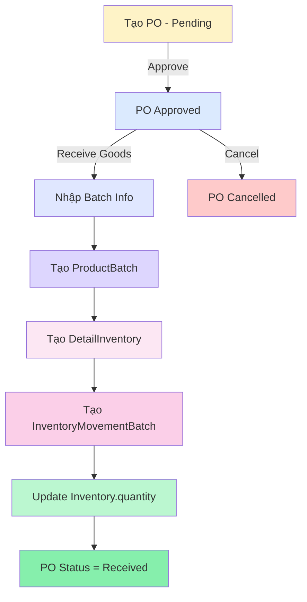

# Purchase Order Workflow - Chuẩn Quản Lý Kho

## 📋 Tổng Quan

Tài liệu này mô tả **workflow CHUẨN** cho quy trình Purchase Order (PO) trong hệ thống quản lý kho, đảm bảo tính toàn vẹn của dữ liệu inventory và batch management.

---

## ✅ Workflow Chuẩn

### Bước 1️⃣: Tạo Purchase Order (Draft)
**Component:** `AddPurchaseOrderModal.jsx`  
**Trạng thái:** `pending`

#### Chức năng:
- Chọn supplier (nhà cung cấp)
- Thêm danh sách products với:
  - Quantity (số lượng)
  - Unit price (đơn giá)
- Set expected delivery date (tùy chọn)
- Add shipping fee, notes

#### Kết quả:
```javascript
{
  supplier: ObjectId,
  orderDate: Date,
  expectedDeliveryDate: Date (optional),
  items: [
    {
      product: ObjectId,
      quantity: Number,
      unitPrice: Number
    }
  ],
  shippingFee: Number,
  totalPrice: Number,
  status: 'pending',      // ✅ Trạng thái ban đầu
  paymentStatus: 'unpaid',
  notes: String
}
```

#### ⚠️ QUAN TRỌNG:
- **KHÔNG** stock in khi tạo PO
- **KHÔNG** tạo batch
- Chỉ lưu thông tin đặt hàng (kế hoạch)

---

### Bước 2️⃣: Approve Purchase Order
**Thao tác:** Dropdown Status → Select "Approved"  
**Trạng thái:** `pending` → `approved`

#### Chức năng:
- Xác nhận đơn hàng với supplier
- Đây là commitment để đặt hàng

#### Kết quả:
```javascript
{
  status: 'approved'  // ✅ Đã xác nhận đơn hàng
}
```

#### ⚠️ QUAN TRỌNG:
- **KHÔNG** stock in khi approve
- **KHÔNG** tạo batch
- Chỉ cập nhật status thành `approved`

---

### Bước 3️⃣: Receive Goods (Nhận Hàng)
**Component:** `ReceivePurchaseOrderModal.jsx`  
**Trigger:** Actions dropdown → "Receive Goods" (chỉ hiện khi status = `approved`)  
**Trạng thái:** `approved` → `received`

#### Chức năng:
Nhận từng sản phẩm một với batch information:

1. **Nhập thông tin batch:**
   - Batch Number (tự động hoặc custom)
   - Manufacturing Date
   - Expiration Date
   - Actual Quantity Received

2. **Tạo ProductBatch:**
```javascript
{
  product: ObjectId,
  batchNumber: String,
  quantity: Number,
  costPrice: Number,
  manufacturingDate: Date,
  expirationDate: Date,
  supplier: ObjectId,
  purchaseOrder: ObjectId
}
```

3. **Tạo DetailInventory (Stock In):**
```javascript
{
  product: ObjectId,
  batch: ObjectId,
  quantityChange: Number (positive),
  type: 'purchase_order',
  referenceId: String (PO Number)
}
```

4. **Tạo InventoryMovementBatch:**
```javascript
{
  product: ObjectId,
  batch: ObjectId,
  movementType: 'stock_in',
  quantity: Number,
  referenceType: 'purchase_order',
  referenceId: ObjectId (PO ID)
}
```

5. **Update Inventory.quantity:**
   - Tự động cộng thêm số lượng qua middleware

#### Kết quả:
- ✅ Batch được tạo với thông tin đầy đủ
- ✅ Inventory được stock in
- ✅ Có tracking đầy đủ qua DetailInventory và InventoryMovementBatch
- ✅ PO status → `received` khi tất cả items đã receive

---

## 🚫 Lỗi Workflow CŨ (ĐÃ SỬA)

### ❌ Vấn đề:
```javascript
// CODE CŨ - SAI (đã xóa)
if (newStatus === 'approved') {
  // Stock in WITHOUT batch information
  await inventoryService.stockIn({
    product: productId,
    quantity: quantity,
    // ❌ Thiếu batch info
    // ❌ Thiếu manufacturing/expiration date
  });
}
```

### 🔧 Đã Sửa:
```javascript
// CODE MỚI - ĐÚNG
if (newStatus === 'approved') {
  // ✅ CHỈ cập nhật status
  // Stock in sẽ diễn ra ở ReceivePurchaseOrderModal
  alert('Next step: Use "Receive Goods" to create batches and stock in.');
}
```

---

## 📁 Files Liên Quan

### Frontend Components:
1. **`AddPurchaseOrderModal.jsx`** (MỚI)
   - Tạo PO mới
   - Status: `pending`
   - Không stock in

2. **`EditPurchaseOrderModal.jsx`**
   - Sửa PO đang pending/approved
   - Không thay đổi inventory

3. **`ReceivePurchaseOrderModal.jsx`**
   - Nhận hàng + tạo batch + stock in
   - Chỉ available cho PO đã approve

4. **`PurchaseOrderList.jsx`**
   - Hiển thị danh sách PO
   - Dropdown status (approve/cancel)
   - Actions: View Invoice, Receive Goods, Edit, Delete

5. **`PurchaseOrderListHeader.jsx`**
   - Filters, search
   - Nút "Add Purchase Order"

### Backend:
- **`controllers/purchaseOrders.js`**: CRUD operations
- **`models/purchaseOrder.js`**: Schema with status validation
- **`models/productBatch.js`**: Batch management
- **`services/inventoryService.js`**: Stock in/out operations

---

## 🎯 Luồng Dữ Liệu



---

## 📊 Bảng Trạng Thái

| Status | Mô Tả | Actions Available | Stock In? |
|--------|-------|-------------------|-----------|
| `pending` | PO mới tạo | Edit, Approve, Cancel | ❌ NO |
| `approved` | Đã xác nhận | **Receive Goods**, Cancel | ❌ NO |
| `received` | Đã nhận hàng | View Invoice, Delete | ✅ YES (via Receive Modal) |
| `cancelled` | Đã hủy | Delete | ❌ NO |

---

## 🔐 Business Rules

### 1. Status Transitions:
```
pending → approved → received
pending → cancelled
approved → cancelled (không reverse inventory vì chưa stock in)
```

### 2. Edit Rules:
- Chỉ edit được khi `pending` hoặc `approved`
- Không edit được khi `received` hoặc `cancelled`

### 3. Delete Rules:
- Chỉ delete được khi `received` hoặc `cancelled`
- Không delete được khi `pending` hoặc `approved` (tránh mất dữ liệu đơn hàng đang xử lý)

### 4. Receive Goods Rules:
- Chỉ available khi status = `approved`
- Bắt buộc nhập batch information:
  - Manufacturing Date
  - Expiration Date
  - Batch Number
- Có thể receive partial (từng item một)

---

## 🧪 Test Cases

### Test 1: Create PO
1. Click "Add Purchase Order"
2. Select supplier
3. Add products with quantities
4. Submit
5. ✅ Verify: PO created with status `pending`
6. ✅ Verify: Inventory NOT changed

### Test 2: Approve PO
1. Select pending PO
2. Change status to `approved`
3. ✅ Verify: Status changed
4. ✅ Verify: Inventory NOT changed
5. ✅ Verify: "Receive Goods" button appears

### Test 3: Receive Goods
1. Click "Receive Goods" on approved PO
2. Fill batch info for each item:
   - Batch number
   - Manufacturing date
   - Expiration date
   - Quantity
3. Submit
4. ✅ Verify: ProductBatch created
5. ✅ Verify: DetailInventory created
6. ✅ Verify: InventoryMovementBatch created
7. ✅ Verify: Inventory.quantity increased
8. ✅ Verify: PO status = `received`

### Test 4: Cancel Approved PO
1. Select approved PO (chưa receive)
2. Change status to `cancelled`
3. ✅ Verify: Status changed
4. ✅ Verify: Inventory NOT changed (vì chưa stock in)

---

## 📝 Code Examples

### 1. Tạo Purchase Order:
```javascript
const poData = {
  supplier: supplierId,
  orderDate: new Date(),
  items: [
    {
      product: productId,
      quantity: 100,
      unitPrice: 25.50
    }
  ],
  shippingFee: 50,
  status: 'pending',  // ✅ IMPORTANT
  paymentStatus: 'unpaid'
};

const response = await purchaseOrderService.createPurchaseOrder(poData);
```

### 2. Approve Purchase Order:
```javascript
// Chỉ cập nhật status, KHÔNG stock in
await purchaseOrderService.updatePurchaseOrderStatus(poId, 'approved');

// Alert user về next step
alert('PO approved. Next: Receive Goods to stock in.');
```

### 3. Receive Goods:
```javascript
// Tạo batch
const batch = await productBatchService.createBatch({
  product: productId,
  batchNumber: 'B001',
  quantity: 100,
  costPrice: 25.50,
  manufacturingDate: '2024-01-01',
  expirationDate: '2025-01-01',
  supplier: supplierId,
  purchaseOrder: poId
});

// Tạo detail inventory (stock in)
await detailInventoryService.createDetailInventory({
  product: productId,
  batch: batch.id,
  quantityChange: 100,
  type: 'purchase_order',
  referenceId: poNumber
});

// Tạo movement batch
await inventoryMovementBatchService.createMovement({
  product: productId,
  batch: batch.id,
  movementType: 'stock_in',
  quantity: 100,
  referenceType: 'purchase_order',
  referenceId: poId
});

// Update PO status
await purchaseOrderService.updatePurchaseOrderStatus(poId, 'received');
```

---

## 🎨 UI/UX Flow

### 1. Purchase Orders Page:
```
┌─────────────────────────────────────────────────┐
│ Purchase Orders                                 │
│ ┌──────────────────────────────────────────┐   │
│ │ [10 ▼] [Search...] [🔍] [+ Add PO] [Actions ▼] │
│ └──────────────────────────────────────────┘   │
│                                                  │
│ Status: [All ▼] Payment: [All ▼] Supplier: [All ▼] │
│                                                  │
│ ┌────────────────────────────────────────────┐ │
│ │ ID    Supplier  Items Total  Status    ⋮  │ │
│ │ PO001 ABC Corp  5     $1,250 🟡 Pending  │ │
│ │ PO002 XYZ Ltd   3     $890   🔵 Approved │ │
│ │ PO003 DEF Inc   8     $2,100 🟢 Received │ │
│ └────────────────────────────────────────────┘ │
└─────────────────────────────────────────────────┘
```

### 2. Actions Dropdown (Approved PO):
```
┌────────────────────┐
│ 📄 View Invoice    │
│ 📦 Receive Goods   │ ← Chỉ hiện khi approved
│ ✏️  Edit           │
│ ──────────────────│
│ 🗑️  Delete         │
└────────────────────┘
```

### 3. Receive Goods Modal:
```
┌─────────────────────────────────────────┐
│ Receive Purchase Order: PO002           │
│                                          │
│ Product: Widget A (Ordered: 100)        │
│ ┌────────────────────────────────────┐  │
│ │ Batch Number: B001                 │  │
│ │ Mfg Date: [2024-01-01]            │  │
│ │ Exp Date: [2025-01-01]            │  │
│ │ Quantity: [100]                    │  │
│ │                                     │  │
│ │ [Cancel] [✓ Receive This Item]     │  │
│ └────────────────────────────────────┘  │
│                                          │
│ Received: 1/3 items                     │
└─────────────────────────────────────────┘
```

---

## 🔍 Debugging Tips

### Kiểm tra Stock In có chạy đúng:
```javascript
// 1. Check DetailInventory
const details = await DetailInventory.find({ 
  referenceId: poNumber 
});
console.log('Stock in records:', details);

// 2. Check ProductBatch
const batches = await ProductBatch.find({ 
  purchaseOrder: poId 
});
console.log('Batches created:', batches);

// 3. Check Inventory quantity
const inventory = await Inventory.findOne({ product: productId });
console.log('Current inventory:', inventory.quantity);

// 4. Check InventoryMovementBatch
const movements = await InventoryMovementBatch.find({
  referenceId: poId
});
console.log('Movement records:', movements);
```

### Common Issues:
1. **Inventory không tăng sau receive:**
   - Check DetailInventory có được tạo không
   - Check pre-save hook của DetailInventory

2. **Batch không có expiration date:**
   - Verify input form có require field này
   - Check validation trong ProductBatch model

3. **PO status không đổi thành received:**
   - Check tất cả items đã receive chưa
   - Verify update status API call

---

## 📚 Related Documentation

- [BATCH_MANAGEMENT_WORKFLOW.md](./BATCH_MANAGEMENT_WORKFLOW.md) - Quản lý batch FEFO
- [MODEL_STANDARD.md](./MODEL_STANDARD.md) - Chuẩn models
- [PRE_SAVE_HOOK_IMPROVEMENTS.md](./PRE_SAVE_HOOK_IMPROVEMENTS.md) - Pre-save hooks

---

## 📅 Change Log

### 2024-01-XX - v1.0
- ✅ Tạo AddPurchaseOrderModal component
- ✅ Loại bỏ logic stock-in sai khi approve
- ✅ Thêm nút "Receive Goods" cho approved POs
- ✅ Cập nhật PurchaseOrderList workflow
- ✅ Tài liệu hóa workflow chuẩn

---

**Tác giả:** Development Team  
**Ngày tạo:** 2024-01-XX  
**Phiên bản:** 1.0
